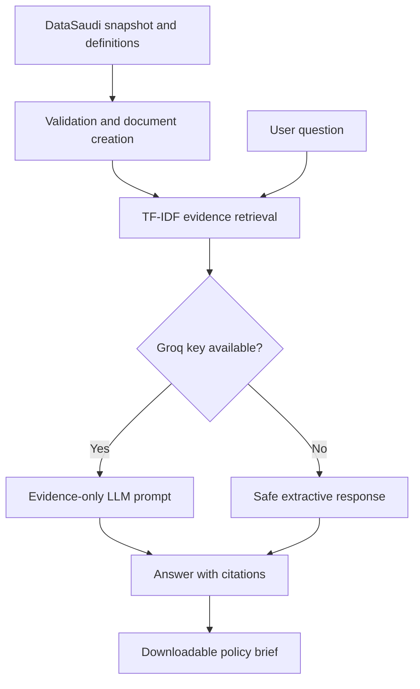

# Saudi Data-Driven Policy Assistant

An evidence-grounded, bilingual Saudi economic intelligence application for policy-relevant questions, using official-source snapshots, live indicator APIs, and curated economic definitions.

## Solution overview

The project combines retrieval-augmented generation (RAG), evidence ranking, prompt engineering, bilingual generation, source citations, prompt-injection checks, automated policy briefs, and a Streamlit interface. It is not a forecasting model and does not present generated text as official analysis.

## Main features

- English and Arabic questions and answers
- Five core domains: growth, prices, trade, labour, and business activity
- TF-IDF retrieval over structured observations and curated definitions
- Automatic selection of a Groq chat model available to the user's account
- Safe offline evidence mode when no API key is available
- Source links, data dates, downloadable briefs, and CSV evidence explorer
- Professional Streamlit dashboard with a searchable indicator filter
- Frequency-aware reporting periods on every overview card (monthly, quarterly, or annual)
- Unit-safe Plotly charts for any selected indicators, including a Select all option
- Independent Line, Bar, Area, and Scatter selection for every visualization
- On-screen latest/history data tables with filtered CSV downloads
- Canonical indicator-name matching prevents duplicate live and fallback GDP cards
- Historical API observations are indexed for questions about trends, comparisons, averages, and earlier periods
- The Policy Assistant is the first and default workspace, with Overview available as the second tab
- Tests for data quality, retrieval, security, and brief generation
- Optional generic DataSaudi Tesseract API client for future live-data extensions
- Config-driven live APIs for all selected indicators, with packaged-data fallback

## Architecture



## Recommended: deploy without VS Code

Use the browser-only instructions in `START_HERE_GITHUB_STREAMLIT.md`. You can upload the ready project directly to GitHub and deploy it on Streamlit Community Cloud without installing Python.

## Optional: run locally

1. Install Python 3.12 from `python.org`. During installation select **Add Python to PATH**.
2. Open Command Prompt inside the project folder and run:

```cmd
python -m venv .venv
.venv\Scripts\activate
python -m pip install --upgrade pip
pip install -r requirements.txt
```

4. Copy `.env.example` to `.env` and place your Groq key in `.env`. Never upload `.env` to GitHub.
5. Run the tests:

```cmd
pytest
```

6. Start the application:

```cmd
streamlit run app.py
```

The app also works without a key in safe offline retrieval mode.

## Obtain a Groq API key

1. Open `https://console.groq.com/keys`.
2. Sign in and create a new API key.
3. Copy `.env.example` as `.env`.
4. Replace the example value with your actual key.
5. Do not place the key directly inside `app.py` or a notebook output.

## Deploy to GitHub

1. Create a new private GitHub repository.
2. Upload the contents of this folder, including `.streamlit/config.toml` and `.python-version`.
3. Do not upload `.env` or `.streamlit/secrets.toml`.
4. Confirm that `app.py` and `requirements.txt` are in the repository root.

If GitHub's **Add file** interface hides `.python-version`, create it using **Add file > Create new file**, type `.python-version`, add `3.11`, and commit it.

## Deploy to Streamlit Community Cloud

1. Sign in at `https://share.streamlit.io` using GitHub.
2. Select **Create app** and choose the repository, branch, and `app.py`.
3. Open **Advanced settings > Secrets** and add:

```toml
GROQ_API_KEY = "gsk_your_real_key"
GROQ_MODEL = "auto"
```

4. Deploy the app and inspect the logs if installation fails.
5. Test both a factual question and an unsupported question before sharing the link.

## Optional Colab workspace

Open `notebooks/Saudi_Economic_Policy_Copilot.ipynb` in Google Colab to review the retrieval and generation workflow. Streamlit deployment uses the repository files.

## Live DataSaudi extension

`src/datasaudi_api.py` implements the keyless Tesseract request grammar. Live querying requires a valid cube, leaf-level drilldown names, and measures. The packaged app intentionally uses a verified snapshot so that the demonstration remains stable if the public API is slow or changes.

## Connect live APIs for selected indicators

Every selected indicator has a ready configuration entry in `data/api_indicators.json`. Add the official JSON endpoint, map its date and value fields, set `enabled` to `true`, and use **Refresh enabled APIs** in the app. The app replaces only successfully refreshed indicators and keeps the packaged data for every other indicator.

Read `docs/INDICATOR_API_GUIDE.md` for copy-and-paste examples, secure API-key setup, DataSaudi Tesseract configuration, and testing steps.

For the direct-URL workflow, use `data/api_direct_entry_template.json`, `docs/DIRECT_API_TEMPLATE_GUIDE.md`, and `docs/INDICATOR_CATALOG.md`. The API reader automatically paginates DataSaudi Tesseract results before applying category filters.

## Evaluation

Use `data/evaluation_questions.json` and record:

- Retrieval Hit@5: whether the necessary source appears in the top five passages
- Citation coverage: factual sentences carrying a source marker
- Numeric accuracy: exact agreement with the verified snapshot
- Abstention accuracy: unsupported questions clearly identified as unsupported
- Bilingual quality: human rating from 1–5 for Arabic and English clarity
- Latency: seconds per generated answer

## Limitations

- The packaged data are a small point-in-time snapshot, not the complete DataSaudi database.
- TF-IDF retrieval has limited semantic understanding compared with embedding models.
- LLM outputs can still contain mistakes and require expert review.
- Observed associations should not be presented as causal effects.
- Data may be revised after the stated access date.

## Data attribution

The demonstration observations are attributed to [DataSaudi](https://datasaudi.sa/en), a platform presenting Saudi economic and social indicators. Always verify data against the latest official release before publication.
